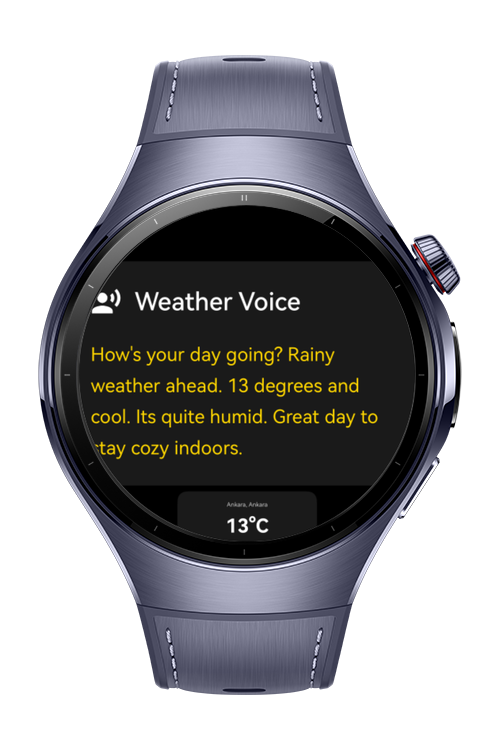
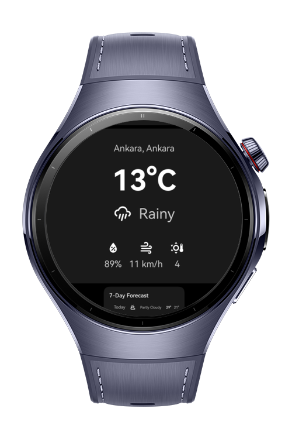
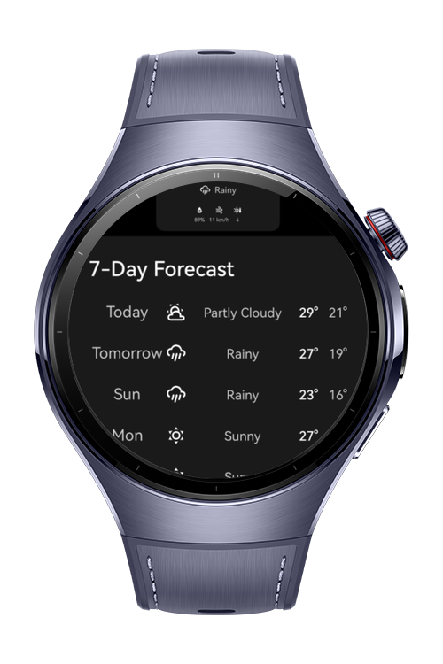
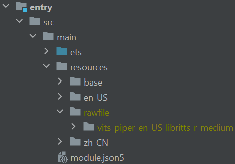

> **Note:** To access all shared projects, get information about environment setup, and view other guides, please visit [Explore-In-HMOS-Wearable Index](https://github.com/Explore-In-HMOS-Wearable/hmos-index).

# WeatherVoice

A voice assisted weather app for wearable devices.

# Preview

<div>
  
  
  
</div>

# Use Cases

WeatherVoice is designed for hands-free access to weather information on wearable devices. The app's general use cases are;
- **Quick Briefing:** Get a complete weather overview without looking at your watch.
- **Accessibility:** Provides an audio-first experience for users who prefer or require voice-based interfaces.
- **Multitasking:** Access weather information while performing other tasks, perfect for busy professionals

# Technology

## Stack

- **Languages**: ArkTS, ArkUI
- **Frameworks**: HarmonyOS SDK 5.1.0(18)
- **Tools**: DevEco Studio Vers 5.1.0.820
- **Libraries**: @kit.ArkUI, @kit.ArkTS, @kit.AudioKit, @kit.CryptoArchitectureKit, @kit.CoreFileKit, @ohos.worker
- **OHPM Packages**: sherpa-onnx

## Prerequisites

**OHPM Sherpa-ONNX package:** https://ohpm.openharmony.cn/#/en/detail/sherpa_onnx

For the project to work you need to download and extract the TTS model to this directory;
*entry/src/main/resources/rawfile*

It should look like this;



You can directly download the model via this link;
https://github.com/k2-fsa/sherpa-onnx/releases/download/tts-models/vits-piper-en_US-libritts_r-medium.tar.bz2

If you would like to see other models you can take a look at their official documentations;
https://k2-fsa.github.io/sherpa/onnx/tts/pretrained_models/

# Directory Structure

```
WeatherVoice/
│
├── entry/
│   └── src/
│       └── main/
│           ├── ets/
│           │   ├── engines/                        #Core business logic engine
│           │   │   └── WeatherAnnouncementEngine.ets
│           │   ├── constants/                      #Shared UI Constants
│           │   │   └── UIConstants.ets
│           │   ├── components/                     #Shared UI Components
│           │   │   └── DailyForecastCard.ets
│           │   │   └── LoadingView.ets
│           │   ├── models/                         #Data models
│           │   │   ├── WeatherCondition.ets
│           │   │   └── WeatherData.ets
│           │   ├── pages/                          
│           │   │   └── Index.ets                   #Main Weather page with TTS
│           │   ├── services/                       #Data and business services
│           │   │   ├── SimpleWeatherDataService.ets
│           │   │   └── WeatherSpeechTextService.ets
│           │   ├── utils/                          #Utility classes
│           │   │   └── WeatherConstants.ets
│           │   │   └── SecureRandomUtil.ets
│           │   └── workers/                        #Worker threads for TTS
│           │       └── NonStreamingTtsWorker.ets
│           └── resources/
│               └── rawfile/
│                   └── (TTS model files)
```

# Constraints and Restrictions

## Supported Devices;
  - Huawei Watch 5

# License

**WeatherVoice** is distributed under the terms of the MIT license. See the [LICENSE](LICENSE) for more information.
